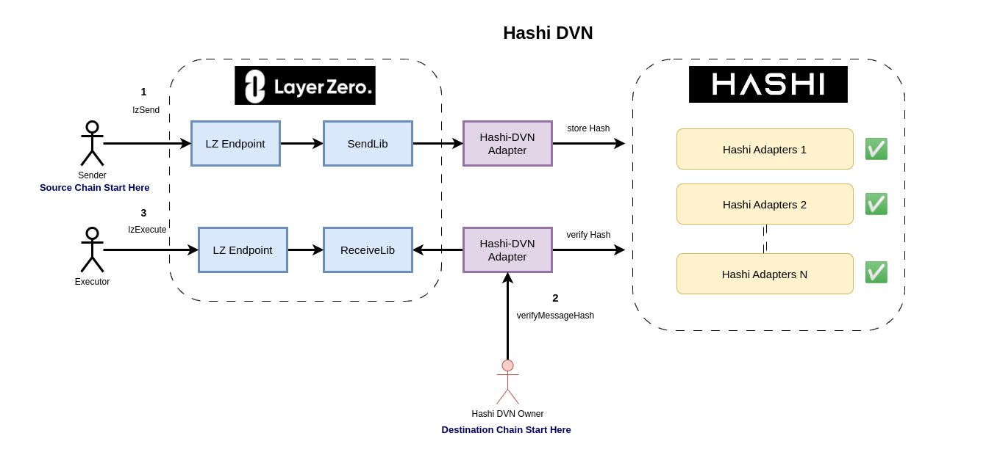

# Hashi DVN

Hashi integration of [Layer Zero v2 DVN](https://docs.layerzero.network/contracts/configure-dvns).



## Workflow

This is the end to end workflow of how a Hashi DVN Adapter will be used by an [Oapp](https://docs.layerzero.network/contracts/oapp)

### Configuration from developer

In order to use Hashi DVN for your Oapp, Oapp developer need to register the DVN in the source endpoint's config.

1. Oapp calls `Endpoint.[setConfig](https://docs.layerzero.network/contracts/configure-dvns#set-config)` to add HashiDVN as one of the DVN.

### Configuration from Hashi

Underlying Hashi DVN is a combination of Hashi Message Relay and it's corresponding adapter. The addresses and fee is registered in [HashiRegistry.sol](./src/HashiRegistry.sol).

1. set eid to chainID mapping
2. set Hashi Registry for hashi adapters addresses and fee.

### Source Chain

On chain interaction from source chain.

1. Sender calls LzEndpoint (or Oapp that will call LzEndpoint eventually).
2. LzEndpoint calls SendLib (default to ULN302)
3. SendLib calls HashiDVNAdapter `assignJob` and pay HashiDVN fee (fee is fetched from `HashiRegistry. getFee`)
4. HashiDVNAdapter calls `yaho.dispatchMessageToAdapters` to relay the messageHash.

### Off Chain

Hashi DVN will listen to the following events and call [HashiDVNAdapter.sol](./src/HashiDVNAdapter.sol) on destination chain.

1. Listen to PacketSent (to get payload) and DVNFeedPaid(check if it is called) event
2. Listen to MessageDispatched(for messageId) event

### Destination Chain

To verify the message, Hashi DVN owner will call HashiDVNAdapter.verifyMessageHash(), with messageId from Yaho contract, and payload of the corresponding LayerZero packet. If the messageHash stored in Hashi Adapters are matched, the message(or packet in LZ's term) is verified.

1. call `HashiDVNAdapter.verifyMessageHash(messageId, payload)`
2. HashiDVNAdapterl calls `Hashi.getHash` to check if all adapters agree on the same hash.
3. If true, HashiDVNAdapter calls `ReceiveLib.verify` to set verify mapping to true.
4. Executor calls `commitAndExecute` message

## Documentation

https://hashi-doc.gitbook.io/hashi/v0.1/application

## Usage

### Install

```shell
$ yarn install
```

### Compile

```shell
$ yarn hardhat compile
```

### Test

```shell
$ yarn hardhat test
```
